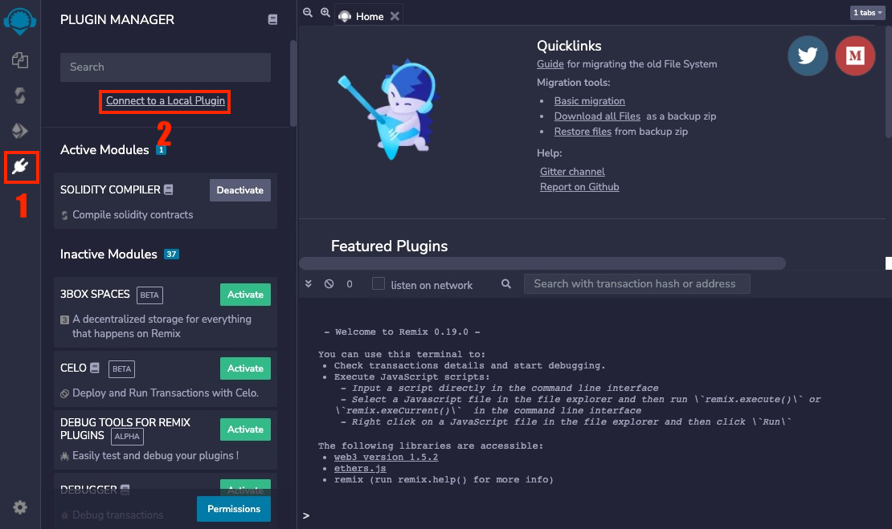
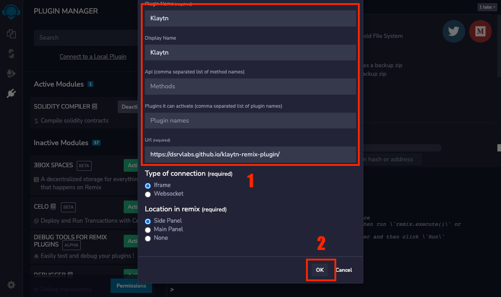

# Kaikas Plugin for Remix

The Kaikas plugin for Ethereum's Remix IDE. It support for deploy and interacting on a Kaikas network.

# Getting Started
1. Select Local Plugin

2. Input Plugin URL (https://dsrvlabs.github.io/klaytn-remix-plugin)

3. Click Kaikas Plugin Icon
4. Connect [klaytn Extension Wallet](https://chrome.google.com/webstore/detail/kaikas/jblndlipeogpafnldhgmapagcccfchpi) Account
5. Compile your smart contract
6. Select Contract to deploy
7. Deploy

